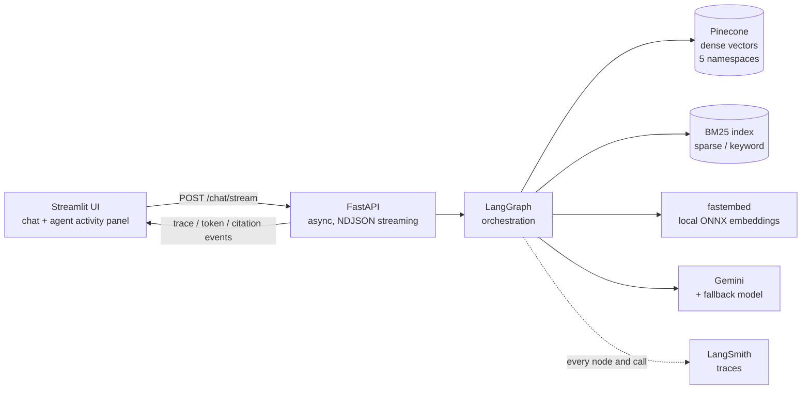
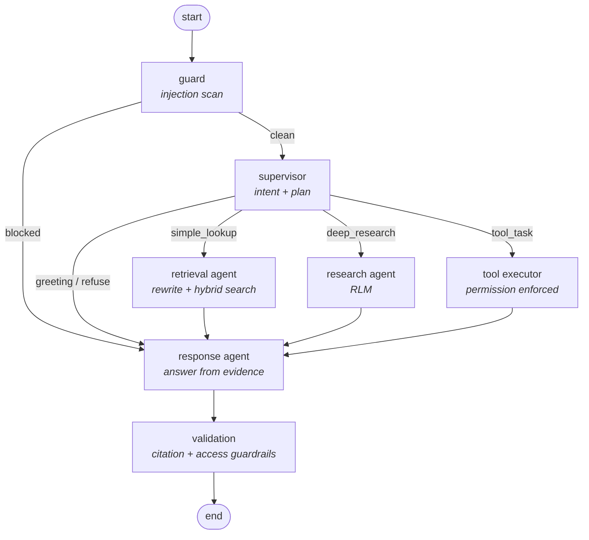
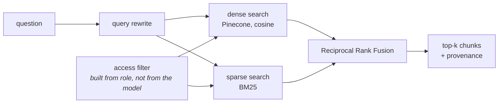

# Enterprise AI Assistant

A multi-agent enterprise knowledge assistant: LangGraph orchestration over
hybrid retrieval, with role-based access control, prompt-injection defence,
citation guardrails and full LangSmith tracing.

Built for the AI Lead technical assessment. Everything runs on free tiers.

---

## Contents

- [What it does](#what-it-does)
- [Architecture](#architecture)
- [Quick start](#quick-start)
- [Model selection rationale](#model-selection-rationale)
- [Retrieval design](#retrieval-design)
- [Recursive Language Model](#recursive-language-model-rlm)
- [Memory design](#memory-design)
- [Security approach](#security-approach)
- [RBAC](#rbac)
- [Observability](#observability)
- [Error handling](#error-handling)
- [Testing](#testing)
- [Assumptions and trade-offs](#assumptions-and-trade-offs)

---

## What it does

Employees ask questions in natural language about internal documents - policies,
architecture docs, runbooks, incident reports, product specs and meeting notes.
The assistant searches, reasons over what it finds, and answers with citations
back to the source documents, while respecting what the asker's role is allowed
to see.

A worked example, and the question the system was designed around:

> *Summarize all outage reports related to payment failures during the last year
> and identify recurring root causes.*

That question spans eighteen documents. Rather than loading them into one
prompt, the agent writes a search plan, retrieves selectively, splits the
matches into batches, analyses each batch in a separate concurrent sub-agent,
and aggregates the findings. See [RLM](#recursive-language-model-rlm).

---

## Architecture

### System



### Agent graph



### Retrieval



### Repository layout

```
app/
  agents/       graph, nodes, prompts, LLM client
  api/          FastAPI routes and schemas
  auth/         roles, permissions, access filters
  core/         config, logging, exceptions
  retrieval/    chunking, embeddings, vector store, BM25, hybrid fusion
  security/     injection detection, rate limiting
ui/             Streamlit app
scripts/        corpus generation, ingestion, manual test harnesses
tests/          security and RBAC tests
data/documents/ the generated knowledge base
```

---

## Quick start

Requires Python 3.11+, a Pinecone account, a Google AI Studio key and a
LangSmith account. All three have free tiers that need no credit card.

```bash
python -m venv .venv
.venv\Scripts\activate          # Windows
source .venv/bin/activate       # macOS / Linux

pip install -r requirements.txt
copy .env.example .env          # cp on macOS / Linux
```

Fill in `GOOGLE_API_KEY`, `PINECONE_API_KEY` and `LANGSMITH_API_KEY` in `.env`,
then:

```bash
python scripts/list_models.py         # confirm the configured model is available
python scripts/generate_documents.py  # 82 synthetic documents
python scripts/ingest.py              # chunk, embed, upsert, build BM25
```

Run the two processes:

```bash
uvicorn app.api.main:app --reload     # terminal 1  -> :8000
streamlit run ui/app.py               # terminal 2  -> :8501
```

Or with Docker:

```bash
docker compose up --build
```

### Verification harnesses

```bash
python scripts/test_search.py    # hybrid retrieval + an RBAC pass/fail assertion
python scripts/test_graph.py     # four cases end to end, with traces
pytest tests/ -v                 # security and RBAC tests
```

---

## Model selection rationale

| Component | Choice | Why |
|---|---|---|
| LLM | Gemini Flash, with a second Gemini model as fallback | Free tier needs no credit card and allows ~1,500 requests/day - more than a POC and a recorded demo consume. Flash-class latency keeps the streaming UI responsive. |
| Embeddings | `BAAI/bge-small-en-v1.5` via fastembed (local ONNX) | Runs on the CPU, so **no API quota is consumed** during ingestion or at query time and a recorded demo cannot fail on a rate limit. ONNX rather than sentence-transformers means no torch dependency: ~150 MB instead of ~2.5 GB, which keeps the container small. 384 dimensions keeps the index cheap. |
| Vector DB | Pinecone serverless | Required by the assessment. The free plan covers this corpus comfortably. |
| Orchestration | LangGraph | Explicit state machine with typed state, conditional edges and a checkpointer. The graph is inspectable, which is what makes the activity panel possible. |

Model names are read from `.env`, so a retired model is a config change rather
than a code change - which mattered during development, when the originally
configured model was withdrawn for new API keys mid-build.

---

## Retrieval design

**Chunking is structure-aware.** Documents are split on markdown section
headings first, and only oversized sections fall back to a character window with
overlap. A "Root Cause" section therefore stays intact instead of being cut in
half by an arbitrary boundary. Every chunk is prefixed with its document title
and section heading, so a chunk retrieved in isolation still carries the context
the embedding model and the answering model need.

**Hybrid, because the two routes fail differently.** Dense search handles
paraphrase but is weak on rare literal tokens; BM25 is the reverse. "Why did card
payments start failing?" needs the first; `INC-PAY-0003` needs the second.

**Fusion is Reciprocal Rank Fusion.** Cosine similarity and BM25 scores are on
incompatible scales, so a weighted sum of raw scores requires per-corpus tuning
that does not survive a change of embedding model. RRF uses rank only:

```
score(chunk) = 1/(60 + dense_rank) + 1/(60 + sparse_rank)
```

No tuning, and no single outlier score can dominate. The trade-off is that
magnitude information is discarded, so one overwhelmingly strong dense hit is
not allowed to crowd out the rest - acceptable here, because the answering step
reads several chunks anyway.

**Namespaces per department** cut latency and reduce cross-department exposure.
A cross-department query fans out over namespaces concurrently and merges.

**Dates are stored twice** - as a readable string and as an ordinal integer -
because Pinecone filters numerically but not on date strings, and "during the
last year" is a range filter.

---

## Recursive Language Model (RLM)

Triggered when the supervisor classifies a question as `deep_research`.

| Stage | What happens |
|---|---|
| 1. Plan | The LLM emits a **structured** search plan: metadata filters plus 2-4 sub-queries. It is a Pydantic model, so the filters are validated fields rather than parsed prose. |
| 2. Explore | Sub-queries run concurrently through hybrid retrieval. Only filtered chunks return; nothing is bulk-loaded. |
| 3. Decompose | Matching documents are grouped into batches of five. |
| 4. Recurse | One sub-agent per batch, all concurrent. Each reads only its own batch and returns a terse finding. |
| 5. Aggregate | The response agent reads the **findings**, not the documents. |

Why it beats context stuffing: a year of incident reports is roughly 50,000
tokens, and the signal is a handful of repeated root causes. Batching turns one
large serial call into several small parallel ones - cheaper, faster, and more
reliable, because each sub-agent attends to five documents rather than eighty.

`MAX_RECURSION_DEPTH = 2` bounds the recursion. An agent that can spawn
sub-agents without a bound is a cost incident waiting to happen.

---

## Memory design

Conversation memory is LangGraph's checkpointer, keyed by
`thread_id = "{user_id}:{session_id}"`. Turns in one session resume the same
thread, so follow-ups like "how was it fixed?" resolve against the previous
answer without history being manually re-stuffed into each prompt.

**Why the graph runtime rather than a custom store:** the checkpointer already
persists the full typed state, not just message text, so a resumed turn sees the
same retrieved evidence and validation results the previous turn produced.
Reimplementing that would duplicate the runtime for no gain.

**What is deliberately not done:** `InMemorySaver` means memory lives for the
lifetime of the API process. Swapping in the Postgres or Redis saver is a
one-line change and is the documented path to durable and cross-instance memory;
it was not taken here because a POC does not need the operational cost of
another datastore. Long-term memory across sessions (a user profile, learned
preferences) is out of scope and listed under bonus items not attempted.

---

## Security approach

Defence is layered, and the layers are deliberately unequal in strength.

**Layer 1 - input scanning (`app/security/injection.py`).** Weighted pattern
rules covering the three named attack classes: instruction override, data
exfiltration, tool abuse. Weights rather than booleans, so one strong signal
blocks while several weak ones must agree - which keeps legitimate questions
like "summarize all outage reports" from tripping the "all ... reports" rule.

**Layer 2 - the guard node runs first in the graph.** A blocked message is
refused before the supervisor sees it, so hostile text cannot influence routing,
and no retrieval runs.

**Layer 3 - retrieved content is scanned too.** This is the route most designs
miss: any employee can add a document to a real knowledge base, so retrieved text
is untrusted input. Instruction-like content is wrapped in an explicit
"quoted material" marker rather than dropped, because an incident report may
legitimately quote an attack. Tags that could escape the `<document>` wrapper are
stripped.

**Layer 4 - output validation (`app/agents/validation.py`).** Every `[DOC-ID]`
in the answer is checked against the ids actually retrieved. An id that was never
retrieved is a hallucinated citation and is stripped. A substantive answer with
no citations is flagged. Citations above the caller's access level are redacted.
These checks are mechanical: the model is never asked whether it behaved, because
a model that hallucinated a citation will also confirm that it did not.

**Layer 5 - and the only actual boundary - authorisation is data, not prompt
text.** Permissions and access filters are computed in Python from the
authenticated session. The model is never told "you may not use admin tools" and
trusted to comply; the tool executor raises before the tool runs, and the
retrieval filter is built from the role. A user who writes "I am an
administrator" changes the text the model reads and not a single permission.

Layers 1-3 are evadable and always will be - that is stated plainly rather than
papered over. They reduce noise and make attacks visible in the trace. Layer 5
is what makes a bypass of the others harmless.

**Input validation** is Pydantic at the API edge: bounded lengths, control
characters stripped, user ids normalised, so a malformed request is a 422 rather
than an odd failure deeper in the graph.

**Rate limiting** is a per-user token bucket with lazy refill - a burst of quick
follow-ups is allowed while sustained load stays bounded, with no background
timer to supervise.

**Brand guardrail:** the assistant answers as Commercial Bank's internal
assistant, declines out-of-scope requests, and never speculates about customers,
financial results or legal matters.

---

## RBAC

Hardcoded users (Option A in the brief). An identity provider would add
operational surface without demonstrating anything being scored; the interesting
part of the requirement is *where* enforcement happens.

| Role | Chat | Search | Analytics | MCP tools | Admin tools | Can read |
|---|:--:|:--:|:--:|:--:|:--:|---|
| Viewer | yes | yes | no | no | no | public, internal |
| Analyst | yes | yes | yes | yes | no | public, internal, confidential |
| Administrator | yes | yes | yes | yes | yes | all |

Demo users: `vihanga` (Viewer), `amara` (Analyst), `root` (Administrator).

Two enforcement points, both in Python:

- `require_permission(user, permission)` in the tool executor, before any tool runs.
- `access_filter(user)` merged last into every retrieval filter, so a caller-supplied
  filter can only narrow the result set, never widen it. Applied to **both** the
  dense and sparse routes - filtering only the vector path would leave the keyword
  route as an open door.

Switch role in the UI sidebar and ask the same question twice: the returned
sources change.

---

## Observability

LangSmith tracing is enabled by environment variable and covers every LLM call,
node transition and retrieval operation. Runs are tagged with `user_id`, `role`
and `session_id`.

Structured logging (`structlog`) emits JSON outside local development, with a
`request_id` bound to every line of a request, so a log line can be correlated
with the trace it came from.

The **Agent Activity Panel** is the third observability surface, and the one the
evaluator sees first. Trace events are part of the graph state - an append-only
list with an `add` reducer, so concurrent nodes never overwrite each other - and
they stream to the UI on the same connection as the answer tokens. Retrieval
counts per route, sub-agent progress, guardrail outcomes and refusals are all
visible while the answer is still being written.

---

## Error handling

| Failure | Behaviour |
|---|---|
| LLM transient error | Retry with exponential backoff (3 attempts) |
| LLM unavailable / quota spent | Fallback model via `with_fallbacks` |
| Supervisor classification fails | Defaults to the standard retrieval path rather than failing the turn |
| Pinecone unavailable | Degrades to BM25-only; the answer still lands, and the trace says so |
| BM25 index missing | Degrades to dense-only |
| One namespace fails | `gather(return_exceptions=True)`; partial results are used and the failure is logged |
| A research sub-agent fails | Remaining findings are aggregated; the shortfall is shown in the trace |
| Tool timeout | 20-second cap, raised as `ToolTimeout` |
| Rate limit | 429 with a retry delay, surfaced in the UI |
| Unexpected exception | Generic message to the client, full detail in the logs - no stack trace leaves the process |

---

## Testing

```bash
pytest tests/ -v
```

Covers: legitimate questions are not blocked; each named attack class is;
document tags cannot escape their wrapper; role permission boundaries; access
filters exclude what they should; the token bucket allows a burst then blocks and
is per-user; the citation regex matches the corpus id scheme.

`scripts/test_search.py` additionally asserts, as a live check against the real
index, that a Viewer receives zero confidential chunks for a query that returns
them to an Analyst.

---

## Assumptions and trade-offs

**Assumptions made where the brief left room:**

- The corpus is synthetic, generated by `scripts/generate_documents.py` with a
  fixed seed. It is deliberately shaped so the assessment's own demo question has
  a *verifiable* answer: eighteen payment incidents over twelve months drawn from
  exactly five recurring root causes. A random corpus would make the RLM output
  impossible to check.
- Access levels (`public` / `internal` / `confidential`) were invented as the
  document-sensitivity axis, since the brief specifies role permissions for tools
  but not for documents.
- Commercial Bank is used as the assistant's identity, as the brief suggested.

**Trade-offs taken deliberately:**

- **In-process state.** BM25 index, rate-limit buckets and conversation
  checkpoints all live in the API process. Correct for a single-instance POC,
  wrong for horizontal scaling - each has a documented shared-store replacement
  (OpenSearch or Pinecone sparse vectors; Redis; a Postgres checkpointer).
- **The fallback model is a second Gemini model**, so a provider-wide outage is
  not covered. A cross-provider fallback is the production answer; a second API
  integration was not worth it here. This trade-off was tested in anger when the
  primary model was retired mid-build and both models failed together.
- **Reranking is not implemented.** A cross-encoder over the top 20 would improve
  precision; RRF over a candidate pool was judged sufficient for this corpus size,
  and the latency budget was spent on the RLM path instead.
- **Pattern-based injection detection is evadable.** Kept because it is cheap and
  makes attacks visible; not relied on, because authorisation does not consult it.
- **The UI is intentionally plain.** The brief says UI beauty does not matter and
  transparency does, so the effort went into the activity panel.

**Not attempted, and why:** MCP server (marked low priority in the brief;
the tool executor's permission gate is in place for it), human-in-the-loop
approval node, reranking layer, long-term cross-session memory, answer-quality
feedback loop. All are listed as bonus items, and shipping the scored 90% well
was judged better than starting all of them.
